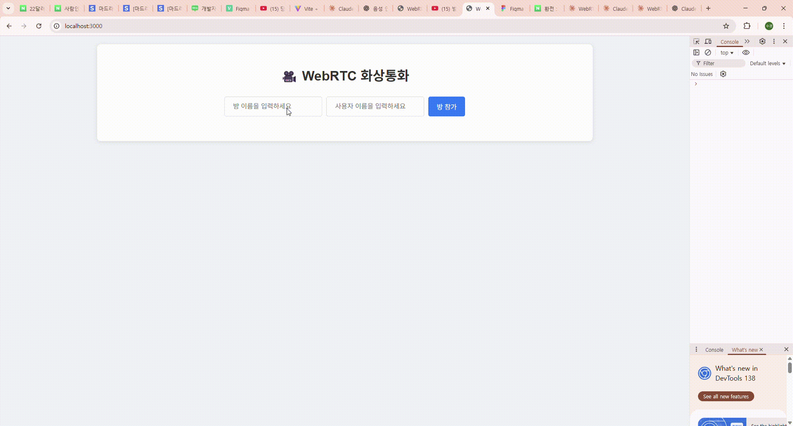

# 🎥 WebRTC 화상통화 앱

실시간 화상통화를 지원하는 웹 애플리케이션입니다. WebRTC와 Socket.IO를 사용하여 P2P 방식의 화상통화를 구현했습니다.




## ✨ 주요 기능

- 🎬 **실시간 화상통화**: WebRTC를 사용한 고품질 화상통화
- 🎤 **음성 컨트롤**: 음소거/음소거 해제 기능
- 📹 **비디오 컨트롤**: 비디오 켜기/끄기 기능
- 🏠 **방 시스템**: 방 이름으로 특정 사용자와 통화
- 👥 **사용자 관리**: 사용자 입장/퇴장 알림
- 📱 **반응형 디자인**: 모바일 및 데스크톱 지원

## 🛠 기술 스택

### Frontend
- **HTML5**: 기본 구조
- **CSS3**: 스타일링 및 반응형 디자인
- **JavaScript (ES6+)**: 클라이언트 사이드 로직
- **WebRTC API**: P2P 화상통화
- **Socket.IO Client**: 실시간 통신

### Backend
- **Node.js**: 서버 런타임
- **Express.js**: 웹 서버 프레임워크
- **Socket.IO**: 실시간 양방향 통신
- **CORS**: 교차 출처 리소스 공유

## 📋 설치 및 실행

### 1. 저장소 클론
```bash
git clone https://github.com/gogoleelee88/webrtc-app.git
cd webrtc-app
```

### 2. 의존성 설치
```bash
npm install
```

### 3. 서버 실행
```bash
npm start
# 또는
node server.js
```

### 4. 브라우저에서 접속
```
http://localhost:3000
```

## 📦 프로젝트 구조

```
webrtc-app/
├── server.js                 # Express 서버 및 Socket.IO 설정
├── package.json              # 프로젝트 의존성 및 스크립트
├── package-lock.json         # 의존성 버전 잠금
├── public/
│   └── index.html            # 클라이언트 HTML 파일
└── README.md                 # 프로젝트 문서
```

## 🚀 사용 방법

### 1. 화상통화 시작하기
1. 브라우저에서 애플리케이션에 접속
2. **방 이름**과 **사용자 이름** 입력
3. **"방 참가"** 버튼 클릭
4. 카메라/마이크 권한 허용
5. 다른 사용자가 같은 방에 입장하면 자동으로 연결

### 2. 컨트롤 사용하기
- **🎤 음소거**: 마이크 on/off
- **📹 비디오 끄기**: 카메라 on/off  
- **📞 통화 종료**: 통화 종료 및 페이지 새로고침

## 🔧 설정

### 환경 변수
```bash
PORT=3000  # 서버 포트 (기본값: 3000)
```

### STUN 서버 설정
기본적으로 Google의 STUN 서버를 사용합니다:
```javascript
const configuration = {
    iceServers: [
        { urls: 'stun:stun.l.google.com:19302' }
    ]
};
```

## 🌐 배포

### Heroku 배포
```bash
# Heroku CLI 설치 후
heroku create your-app-name
git push heroku main
```

### Docker 배포
```dockerfile
# Dockerfile 예시
FROM node:18
WORKDIR /app
COPY package*.json ./
RUN npm install
COPY . .
EXPOSE 3000
CMD ["node", "server.js"]
```

## 🔍 트러블슈팅

### 카메라/마이크 접근 문제
- HTTPS 환경에서만 WebRTC가 정상 동작합니다
- 브라우저 설정에서 카메라/마이크 권한을 확인하세요

### 방화벽 문제  
- 포트 3000이 열려있는지 확인하세요
- 회사 네트워크에서는 WebRTC 트래픽이 차단될 수 있습니다

### 연결 실패
```javascript
// TURN 서버 추가 (NAT 환경에서 필요)
const configuration = {
    iceServers: [
        { urls: 'stun:stun.l.google.com:19302' },
        {
            urls: 'turn:your-turn-server.com',
            username: 'username',
            credential: 'password'
        }
    ]
};
```

## 🤝 기여하기

1. Fork the Project
2. Create your Feature Branch (`git checkout -b feature/AmazingFeature`)
3. Commit your Changes (`git commit -m 'Add some AmazingFeature'`)
4. Push to the Branch (`git push origin feature/AmazingFeature`)
5. Open a Pull Request

## 📝 라이선스

이 프로젝트는 ISC 라이선스 하에 배포됩니다.

## 📞 연락처

- GitHub: [@gogoleelee88](https://github.com/gogoleelee88)
- 프로젝트 링크: [https://github.com/gogoleelee88/webrtc-app](https://github.com/gogoleelee88/webrtc-app)

## 🙏 감사의 말

- [WebRTC API Documentation](https://developer.mozilla.org/ko/docs/Web/API/WebRTC_API)
- [Socket.IO](https://socket.io/)
- [Express.js](https://expressjs.com/)

---

⭐ 이 프로젝트가 도움이 되었다면 Star를 눌러주세요!
